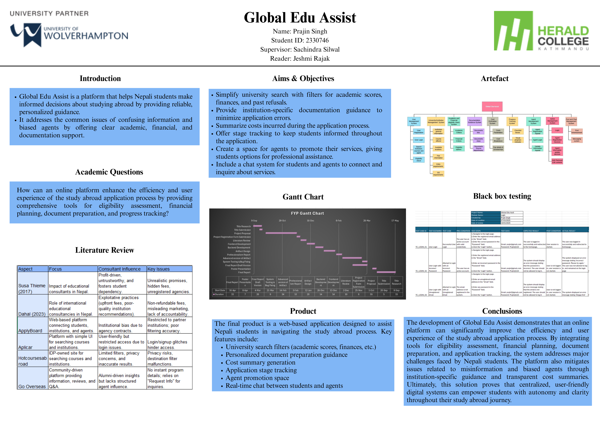

# 🌍 Global Edu Assist

> A full-stack MERN web application that helps Nepali students make informed decisions about studying abroad through eligibility assessment, cost estimation, document guidance, application tracking, and communication with education consultants.


---

## 📸 Screenshots



# 📖 Overview

Global Edu Assist is a centralized platform designed to simplify the study abroad journey for Nepali students.

Instead of relying on scattered information and profit-driven education consultancies, students can compare institutions, estimate study costs, verify eligibility, prepare required documents, monitor application progress, and communicate directly with registered education agents.

The platform provides three different user roles:

- 👨‍🎓 Students
- 🧑‍💼 Education Agents
- 👨‍💻 Super Admin

---

# 🎯 Problem Statement

Many students in Nepal experience difficulties when applying for overseas education due to:

- Conflicting information from multiple sources
- Hidden consultancy charges
- Lack of transparency during application processing
- Confusing documentation requirements
- Difficulty determining eligibility
- Limited access to reliable institutional information

Global Edu Assist aims to solve these issues through a transparent digital platform.

---

# 🎯 Objectives

- Help students discover institutions based on eligibility.
- Provide transparent tuition and living cost estimation.
- Guide students through required documentation.
- Track application progress visually.
- Connect students with registered education consultants.
- Allow administrators to manage institutions, agents, and educational content.

---

# ✨ Features

## 👨‍🎓 Student Features

- User Registration & Login
- Institution Search
- Course Search
- Eligibility Assessment
- Cost Estimation
- Documentation Guidance
- Progress Tracking
- Chat with Registered Agents
- Profile Management

---

## 🏫 Institution Features

- Institution Profiles
- Available Courses
- Campus Locations
- Tuition Fees
- Entry Requirements
- GS Requirements

---

## 📄 Documentation System

- Required Document Lists
- Step-by-Step Guidance
- Issuing Department Information

---

## 💰 Cost Estimation

- Tuition Fees
- Living Costs
- Visa Costs
- Application Fees
- Scholarship Information

---

## 📊 Progress Tracking

Track every stage of an application including:

- Offer Letter
- GS
- COE
- Visa

---

## 🧑‍💼 Agent Portal

- Registration
- Authentication
- Profile Management
- Student Communication
- Advertisement Posting

---

## 👨‍💻 Admin Portal

- Dashboard
- Institution Management
- Agent Approval
- Content Management
- Document Management
- Admin Management

---

# 🛠 Tech Stack

## Frontend

- React.js
- React Router DOM
- Context API
- Axios
- CSS
- Recharts

## Backend

- Node.js
- Express.js
- MongoDB
- Mongoose
- JWT Authentication
- Nodemailer
- Multer
- Cloudinary

---

# 📁 Project Structure

```
Global-Edu-Assist
│
├── Backend
│   ├── config
│   ├── controllers
│   ├── middleware
│   ├── models
│   ├── routes
│   ├── services
│   └── index.js
│
├── Frontend
│   ├── public
│   ├── src
│   │   ├── components
│   │   ├── context
│   │   ├── layouts
│   │   ├── pages
│   │   ├── utils
│   │   └── images
│   └── package.json
│
└── README.md
```

---

# ⚙️ Installation

## Clone the repository

```bash
git clone [https://github.com/your-username/Global-Edu-Assist.git](https://github.com/Prazeen7/Global-Edu-Assist.git)

cd g-e-a
```

---

## Backend Setup

```bash
cd Backend

npm install
```

Create a `.env` file.

```env
JWT_SECRET=
JWT_SECRET_AGENT=
JWT_SECRET_ADMIN=
EMAIL_USER=
EMAIL_PASS=
MONGODB_URI=
CLOUDINARY_CLOUD_NAME=
CLOUDINARY_API_KEY=
CLOUDINARY_API_SECRET=
```

Start the backend server.

```bash
npm run dev
```

---

## Frontend Setup

```bash
cd Frontend

npm install

npm run dev
```

---

# 🔐 User Roles

| Role        | Permissions                                                               |
| ----------- | ------------------------------------------------------------------------- |
| Student     | Search institutions, estimate costs, chat with agents, track applications |
| Agent       | Manage profile, communicate with students, create posts                   |
| Super Admin | Manage institutions, approve agents, manage admins and content            |

---

# 📚 Research Basis

This project is inspired by research highlighting issues in Nepal's education consultancy sector, including:

- Dahal (2023)
- Susa Thieme (2017)

---

# 📄 License

This project is developed for educational purposes.

---

# 👨‍💻 Author

**Prajin Singh**

Bachelor of Science (Hons) in Computer Science

Global Edu Assist — Final Year Project
